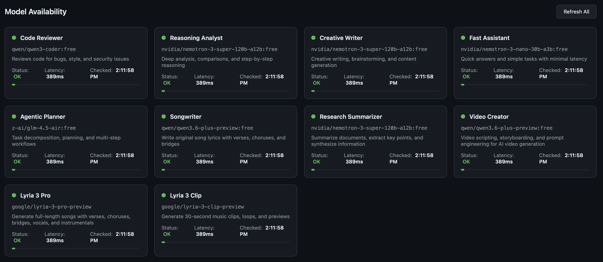

# Agent Orchestrator

A lightweight Python service that exposes multiple named AI agents — each bound to a specific LLM model via [OpenRouter](https://openrouter.ai) — through a simple REST API. Includes music generation via Google Lyria and an agent-chaining pipeline.

```
Client (CLI, web app, IDE)
    → Agent Orchestrator (this service)
        → OpenRouter
            → Claude, GPT, Llama, Gemini, Qwen, Lyria, etc.
```

## Web UI

The service includes a built-in web dashboard at `http://localhost:8000` with a chat interface for all agents and a model availability dashboard.



## Why

- **One API, many models** — call different LLMs through a single endpoint
- **Agent-as-config** — add a new agent by editing a YAML file, no code changes
- **Streaming built-in** — SSE streaming for real-time responses
- **Music generation** — generate songs and clips via Google Lyria 3
- **Agent pipelines** — chain agents together (e.g. songwriter → music generation)
- **MCP server** — built-in Model Context Protocol endpoint at `/mcp`
- **Web UI included** — built-in chat interface and model availability dashboard
- **Zero cost to start** — ships with 8 free text agents + 2 music agents

## Quick Start

### 1. Clone and install

```bash
git clone https://github.com/nanalin888/agent-orchestrator.git
cd agent-orchestrator
python3 -m venv .venv
source .venv/bin/activate
pip install -e .
```

### 2. Add your OpenRouter API key

```bash
cp .env.example .env
```

Edit `.env` and set your key (get one free at [openrouter.ai/keys](https://openrouter.ai/keys)):

```
OPENROUTER_API_KEY=sk-or-v1-your-key-here
```

> **Note:** Text agents use free models (no charges). Music generation with Lyria requires OpenRouter credits ($0.04/clip, $0.08/song).

### 3. Start the service

```bash
python3 -m src.main
```

The server starts at `http://localhost:8000` with 10 agents loaded.

## API Reference

### List agents

```bash
curl localhost:8000/agents
```

Returns all configured agents with their IDs, names, descriptions, and models.

### Get agent info

```bash
curl localhost:8000/agents/code-reviewer
```

### Run a text agent

```bash
POST /agents/{agent_id}/run
```

| Field | Type | Required | Default | Description |
|-------|------|----------|---------|-------------|
| `messages` | array | yes | — | Conversation messages (`role` + `content`) |
| `stream` | bool | no | `false` | Enable SSE streaming |

**Example:**

```bash
curl -X POST localhost:8000/agents/fast-assistant/run \
  -H "Content-Type: application/json" \
  -d '{
    "messages": [
      {"role": "user", "content": "What is 2+2?"}
    ]
  }'
```

**Streaming:**

```bash
curl -N -X POST localhost:8000/agents/creative-writer/run \
  -H "Content-Type: application/json" \
  -d '{
    "messages": [
      {"role": "user", "content": "Write a haiku about code"}
    ],
    "stream": true
  }'
```

### Generate music

```bash
POST /agents/{agent_id}/generate-music
```

| Field | Type | Required | Description |
|-------|------|----------|-------------|
| `prompt` | string | yes | Description of the music to generate |

**Example:**

```bash
curl -X POST localhost:8000/agents/lyria-clip/generate-music \
  -H "Content-Type: application/json" \
  -d '{"prompt": "A chill lo-fi hip hop beat with soft piano and vinyl crackle"}'
```

**Response:**

```json
{
  "agent_id": "lyria-clip",
  "model": "google/lyria-3-clip-preview",
  "caption": "A quintessential Chillhop track...",
  "audio_url": "http://localhost:8000/audio/abc123.mp3",
  "audio_format": "mp3",
  "audio_size_bytes": 744608
}
```

The generated MP3 file is served at the returned `audio_url`.

### Song pipeline (songwriter → music)

Chain the songwriter agent with Lyria to generate lyrics and then turn them into music in a single call.

```bash
POST /pipelines/song
```

| Field | Type | Required | Default | Description |
|-------|------|----------|---------|-------------|
| `prompt` | string | yes | — | Describe the song you want |
| `lyria_agent` | string | no | `lyria-pro` | Which Lyria agent to use (`lyria-pro` or `lyria-clip`) |

**Example:**

```bash
curl -X POST localhost:8000/pipelines/song \
  -H "Content-Type: application/json" \
  -d '{
    "prompt": "A lullaby about a child building with LEGO bricks before bedtime",
    "lyria_agent": "lyria-clip"
  }'
```

**Response:**

```json
{
  "lyrics": "[Verse 1]\nA little brick against the blue...",
  "lyrics_agent": "songwriter",
  "lyrics_model": "qwen/qwen3.6-plus-preview:free",
  "caption": "A gentle lullaby...",
  "audio_url": "http://localhost:8000/audio/def456.mp3",
  "audio_format": "mp3",
  "audio_size_bytes": 744608,
  "music_agent": "lyria-clip",
  "music_model": "google/lyria-3-clip-preview"
}
```

### Multi-turn conversations

Pass the full message history to maintain context:

```bash
curl -X POST localhost:8000/agents/reasoning-analyst/run \
  -H "Content-Type: application/json" \
  -d '{
    "messages": [
      {"role": "user", "content": "What is Python?"},
      {"role": "assistant", "content": "Python is a programming language."},
      {"role": "user", "content": "Compare it to Rust."}
    ]
  }'
```

### Health check

```bash
GET /health
```

## Pre-configured Agents

### Text agents (free)

| Agent ID | Model | Best for |
|----------|-------|----------|
| `code-reviewer` | Qwen3-Coder | Code review, bug detection, security analysis |
| `reasoning-analyst` | Nemotron 3 Super 120B | Step-by-step analysis, comparisons, logic |
| `creative-writer` | Nemotron 3 Super 120B | Creative writing, brainstorming, content |
| `fast-assistant` | Nemotron Nano 9B | Quick answers, low latency tasks |
| `agentic-planner` | GLM-4.5-Air | Task decomposition, planning, workflows |
| `songwriter` | Qwen 3.6 Plus Preview | Song lyrics with structure (verses, chorus, bridge) |
| `research-summarizer` | MiniMax M2.5 | Summarization, long document analysis |
| `video-creator` | Qwen 3.6 Plus Preview | Video scripting, storyboarding, prompt engineering |

### Music agents (requires credits)

| Agent ID | Model | Output |
|----------|-------|--------|
| `lyria-pro` | Google Lyria 3 Pro | Full-length songs with vocals ($0.08/song) |
| `lyria-clip` | Google Lyria 3 Clip | 30-second clips and loops ($0.04/clip) |

## Adding Your Own Agents

Edit `config/agents.yaml` and add an entry:

```yaml
agents:
  my-custom-agent:
    name: "My Custom Agent"
    description: "What this agent does"
    model: "openai/gpt-4o"          # any OpenRouter model ID
    system_prompt: >
      You are a helpful assistant specialized in...
    temperature: 0.7
    max_tokens: 4096
    audio: false                     # set to true for audio generation models
```

Restart the service and it's ready. Browse available models at [openrouter.ai/models](https://openrouter.ai/models).

## Configuration

All configuration is via environment variables (or `.env` file):

| Variable | Required | Default | Description |
|----------|----------|---------|-------------|
| `OPENROUTER_API_KEY` | yes | — | Your OpenRouter API key |
| `AGENTS_CONFIG_PATH` | no | `config/agents.yaml` | Path to agent definitions |
| `HOST` | no | `0.0.0.0` | Server bind address |
| `PORT` | no | `8000` | Server port |

## Project Structure

```
agent-orchestrator/
├── config/
│   └── agents.yaml              # Agent definitions
├── static/
│   └── index.html               # Web UI (chat + dashboard)
├── docs/
│   └── dashboard.png            # Dashboard screenshot
├── src/
│   ├── main.py                  # FastAPI app + static file serving
│   ├── models.py                # Pydantic request/response schemas
│   ├── routes.py                # API endpoints + pipelines
│   ├── agent_registry.py        # YAML config loader
│   ├── openrouter_client.py     # OpenRouter client (text + audio streaming)
│   ├── mcp_server.py            # MCP server for Claude Code integration
│   └── settings.py              # Environment configuration
├── generated_audio/             # Generated MP3 files (gitignored)
├── .env.example                 # Environment template
└── pyproject.toml               # Project metadata + dependencies
```

## License

MIT
